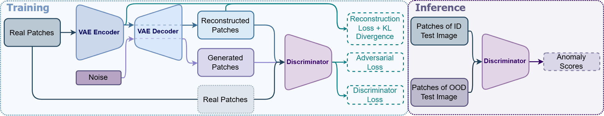

[]()
[](https://github.com/psf/black)
[](https://pycqa.github.io/isort)
[](https://mkdocstrings.github.io)
[](https://wandb.ai/site)
[](https://dvc.org)
[](https://hydra.cc)
[](https://github.com/PyCQA/bandit)

# PatchNorm

<p align="center">
  
</p>

The official implementation of PatchNorm in PyTorch.

## Prerequisites

You will need:

- `python` (see `pyproject.toml` for full version)
- `Git`
- `Make`
- a `.secrets` file with the required secrets and credentials
- load environment variables from `.env`
- `CUDA >= 12.4`

## Installation

Clone this repository (requires git ssh keys)

    git clone --recursive git@github.com:caetas/PatchNorm.git
    cd patchnorm

Install dependencies

    conda env create -f environment.yml
    conda activate python3.11

or if environment already exists

    conda activate python3.11

### Using Linux

Setup the virtualenv using make file recipe

    (python3.11) $ make setup-all

You might be required to run the following command once to setup the automatic activation of the conda environment and the virtualenv:

    direnv allow

Feel free to edit the [`.envrc`](.envrc) file if you prefer to activate the environments manually.

### On Windows

You can setup the virtualenv by running the following commands:

    python -m venv .venv-dev
    .venv-dev/Scripts/Activate.ps1
    python -m pip install --upgrade pip setuptools
    python -m pip install -r requirements/requirements.txt

To run the code please remember to always activate both environments:

    conda activate python3.11
    .venv/Scripts/Activate.ps1

## OOD Benchmark

The evaluation of these models closely follows [OpenOOD's](https://github.com/jingkang50/openood) benchmark. Three types of OOD levels are defined: Near-OOD, which exhibits semantic shifts compared to ID datasets; Far-OOD, which encompasses both semantic and domain shifts; Covariate Shift OOD, which involves corruptions within the ID set. There are also four well-defined ID datasets:

- **ImageNet-1K**
    - **Near-OOD**: SSB-hard, NINCO
    - **Far-OOD**: iNaturalist, DTD, OpenImage-O
    - **Covariate Shift OOD**: ImageNet(-C)

## Datasets Availability

ImageNet-1k is automatically downloaded from HuggingFace when you use the DataLoader.

The remaining datasets can be downloaded using [`datasets_download.py`](src/disconet/datasets_download.py) by running the following commands:

    cd src/patchnorm
    python datasets_download.py [--imagenet]

**Note: Use the `--imagenet` flag if you want to download ImageNet-C.**

##  Model

- PatchNorm [`Code`](src/patchnorm/models/PatchNorm.py)|[`Train Script`](src/patchnorm/train_patchnorm.py)|[`Eval Script`](src/patchnorm/eval_patchnorm.py)|[`Documentation`](docs/PatchNorm.md)

### Train and Evaluate Models

The commands required to train and evaluate each of the models are provided in the documentation section: [`PatchNorm.md`](docs/PatchNorm.md)

### Pre-trained Checkpoint

You can download the pre-trained PatchNorm checkpoint using this [`link`](https://drive.google.com/file/d/1kVPpdR4Sg5-qpDyBVDW2qYLN8kHTPEGh/view?usp=sharing).

### Results for PatchNorm-64

|     OOD Shift      |                Dataset            |          AUROC          |         FPR@95         |
| ------------------ | --------------------------------- | ----------------------- | ---------------------- |
|      Near-OOD      |           SSB-hard<br>NINCO       |    95.8%<br>94.3%       |      19.8%<br>39.0%    |   
|      Far-OOD       | iNaturalist<br>DTD<br>OpenImage-O | 99.1%<br>96.4%<br>94.4% | 3.6%<br>18.9%<br>29.7% |
|   Covariate Shift  |           ImageNet-1K(-C)         |          97.2%          |          10.6%         |

## Experiment Tracking

The code examples are setup to use [Weights & Biases](https://wandb.ai/home) as a tool to track your training runs. Please refer to the [`full documentation`](https://docs.wandb.ai/quickstart) if required or follow the following steps:

1. Create an account in [Weights & Biases](https://wandb.ai/home)
2. **If you have installed the requirements you can skip this step**. If not, activate the conda environment and the virtualenv and run:

    ```bash
    pip install wandb
    ```
3. Run the following command and insert you [`API key`](https://wandb.ai/authorize) when prompted:

    ```bash
    wandb login
    ```

## Repository Information

### Dev

See the [Developer](docs/DEVELOPER.md) guidelines for more information.

### Contributing

Contributions of any kind are welcome. Please read [CONTRIBUTING.md](docs/CONTRIBUTING.md]) for details and
the process for submitting pull requests to us.

## License

This project is licensed under the terms of the `MIT` license.
See [LICENSE](LICENSE) for more details.

## References

All the repositories used to generate this code are mentioned in each of the corresponding files. We would like to list them in no particular order:

- [PyTorch-VAE](https://github.com/AntixK/PyTorch-VAE)
- [conditional-GAN](https://github.com/TeeyoHuang/conditional-GAN)

## Citation

If you publish work that uses PatchNorm, please cite PatchNorm.

**BibTex information will be added later**